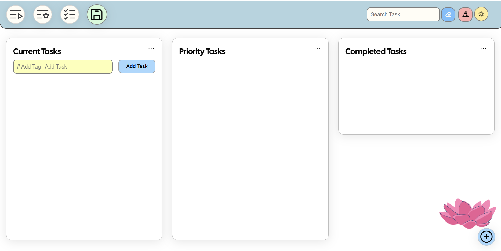

# 📝 Invincible - Task Manager

A lightweight, responsive **Invincible -Task Manager** web app with **local storage** support and an intuitive **bento grid** layout. Organize your tasks efficiently across **Current**, **Priority**, and **Completed** sections — all with a beautiful UI, smooth interactions, and flexible features.

---

## 🔧 Features

- ✅ **Three Task Categories**  
  - **Current Tasks**
  - **Priority Tasks**
  - **Completed Tasks**

- ➕ **Add Tasks Quickly**
  - Simple input interface
  - Hovering "Add Task" button for quick task entry
  - **add tags** to tasks
  - Automatically records the **date added**

- ✏️ **Task Management**
  - **Edit** task name, tags, and date
  - **Delete** individual tasks
  - **Move** tasks between sections freely

- 🔁 **Task Sorting**
  - Sort by **name**, **tag**, or **date** within each section

- 🔍 **Header Controls**
  - **Search bar** with real-time filtering
  - **Clear** button to reset search
  - **"Nuke" button** to delete all tasks instantly
  - **Dark Mode** toggle for better night viewing
  - **Quick Navigation Buttons** to jump to any section (with animated scroll and highlight using `anime.js`)

- 💾 **Persistent Storage**
  - **Local Storage** support to retain tasks even after browser reload
  - Explicit **Save** button to store current state locally

- 📦 **Bento Grid UI**
  - Modular, responsive layout
  - Tags and **task count badges** displayed for all sections
  - Optimized for desktop and mobile devices

---

## 📸 Preview

  

---

## 🛠 Tech Stack

- HTML, CSS, JavaScript
- `anime.js` for smooth UI animations
- Local Storage API

---

## 🔒 Data Persistence

All tasks are stored in the browser’s **local storage** and remain until:
- Individually deleted
- Cleared via **"Nuke"** button

---

## 📌 TODO / Future Enhancements

- Add due dates and reminders
- Sync with cloud or export to file

---

## 🤝 Contributing

Pull requests are welcome! For major changes, please open an issue first to discuss what you would like to change.

---
